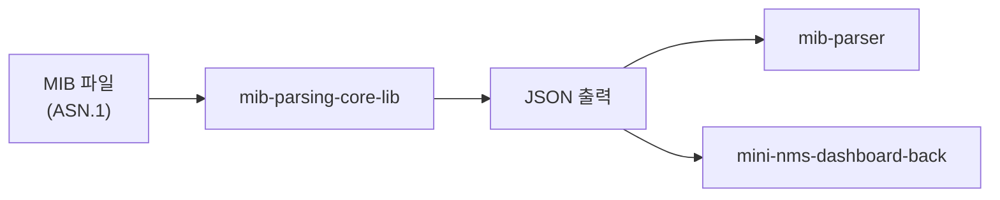

# mib-parsing-core-lib 계획서

## 프로젝트 개요

Mini-NMS Dashboard 시스템의 **핵심 라이브러리**로, SNMP MIB 파일을 파싱하여 수집 가능한 형태의 구조화된 JSON 데이터로 변환합니다.



---

## Approach

net-snmp 라이브러리의 MIB 파싱 기능을 활용하여 TypeScript 라이브러리를 개발합니다.

**핵심 설계 결정:**
- **다양한 입력 지원**: 단일 파일, 다중 파일, 폴더, ZIP 경로 모두 처리
- 폴더/ZIP 내 파일들의 IMPORTS 분석 + Topological Sort로 의존성 자동 해결
- Scalar 타입은 OID에 `.0` 자동 추가 (SNMP GET 호출용)
- 표준 MIB(SNMPv2-SMI, RFC1213 등) 번들 포함

---

## Scope

**In:**
- **입력 경로 처리**
  - 단일 MIB 파일 경로
  - 다중 MIB 파일 경로 배열
  - 폴더 경로 (재귀 탐색)
  - ZIP 파일 경로 (압축 해제 후 처리)
- MIB 파일 파싱 (net-snmp 기반)
- IMPORTS 의존성 자동 해결
- 타입 분류 (Scalar, TableColumn, Table 등)
- Scalar OID `.0` 자동 추가
- 표준 MIB 번들 포함
- JSON 출력

**Out:**
- CLI 인터페이스 (mib-parser 프로젝트)
- SNMP 통신
- GUI

---

## Action Items

### Phase 1: 프로젝트 초기화
- [ ] TypeScript + Node.js 라이브러리 프로젝트 생성
- [ ] ESLint + Prettier 설정
- [ ] Jest 테스트 환경 설정

### Phase 2: 입력 처리
- [ ] 단일 파일 경로 처리
- [ ] 다중 파일 경로 배열 처리
- [ ] 폴더 경로 → 재귀 탐색 후 MIB 파일 목록 추출
- [ ] ZIP 파일 → 임시 폴더에 압축 해제 후 처리

### Phase 3: 핵심 파싱
- [ ] MibParser 클래스 구현
- [ ] net-snmp 라이브러리 래핑
- [ ] 타입 분류 유틸리티 (Scalar/TableColumn 판별)
- [ ] Scalar OID `.0` 자동 추가 로직

### Phase 4: 의존성 해결
- [ ] 입력된 모든 파일에서 IMPORTS 분석
- [ ] 의존성 그래프 구성 + Topological Sort
- [ ] 표준 MIB 자동 로드 (입력에 없는 의존성)
- [ ] 순환 의존성 에러 처리

### Phase 5: 테스트 및 문서화
- [ ] 유닛 테스트 (Jest)
- [ ] 통합 테스트 (폴더/ZIP 입력)
- [ ] README.md 작성

---

## API 설계

```typescript
// 출력 모드
type OutputMode = 'separate' | 'merged';

interface MibParserOptions {
    debug?: boolean;
    outputMode?: OutputMode;  // 기본값: 'separate'
}

class MibParser {
    constructor(options?: MibParserOptions);
    
    // 통합 API (경로 타입 자동 판별)
    parse(input: string | string[]): Promise<ParseResultSummary>;
    
    // 개별 메서드
    parseFile(filePath: string): Promise<ParseResultSummary>;
    parseFiles(filePaths: string[]): Promise<ParseResultSummary>;
    parseDirectory(dirPath: string): Promise<ParseResultSummary>;
    parseZip(zipPath: string): Promise<ParseResultSummary>;
}
```

---

## 타입 정의 설계

```typescript
type MibNodeType = 
    | 'Scalar' | 'TableColumn' | 'Table' | 'TableRow'
    | 'Notification' | 'Group' | 'ModuleIdentity' | 'Node' | 'Unknown';

interface MibSymbolInfo {
    oid: string;       // 호출용 OID (Scalar는 .0 포함)
    rawOid: string;    // MIB 원본 OID
    name: string;
    type: MibNodeType;
    syntax?: any;
    access?: string;
    description?: string;
}

// 개별 모드: 모듈별 결과
interface ModuleParseResult {
    moduleName: string;
    symbols: Record<string, MibSymbolInfo>;
    parsedAt: Date;
}

// 통합 모드: 모든 심볼 통합
interface MergedParseResult {
    modules: string[];  // 포함된 모듈 목록
    symbols: Record<string, MibSymbolInfo>;
    parsedAt: Date;
}

// 파싱 실패 정보
interface ParseError {
    filePath: string;
    error: 'INVALID_EXTENSION' | 'INVALID_FORMAT' | 'PARSE_ERROR' | 'DEPENDENCY_ERROR';
    message: string;
}

// 전체 결과
interface ParseResultSummary {
    mode: 'separate' | 'merged';
    // 개별 모드일 때
    modules?: ModuleParseResult[];
    // 통합 모드일 때
    merged?: MergedParseResult;
    // 에러
    errors: ParseError[];
}
```

### 출력 예시

**개별 모드 (`separate`)**:
```json
{
  "mode": "separate",
  "modules": [
    { "moduleName": "CISCO-SMI", "symbols": {...} },
    { "moduleName": "CISCO-TC", "symbols": {...} }
  ],
  "errors": []
}
```

**통합 모드 (`merged`)**:
```json
{
  "mode": "merged",
  "merged": {
    "modules": ["CISCO-SMI", "CISCO-TC"],
    "symbols": {
      "cisco": {...},
      "ciscoProducts": {...}
    }
  },
  "errors": []
}
```

---

## 에러 핸들링 정책

| 상황 | 처리 방식 |
|------|----------|
| **확장자 불일치** | 지원 확장자(.mib, .txt, .my) 아니면 스킵, errors에 기록 |
| **MIB 형식 아님** | 파싱 시도 후 실패 시 스킵, errors에 기록 |
| **의존성 누락** | 표준 MIB에서 탐색, 없으면 errors에 기록 후 계속 진행 |
| **순환 의존성** | errors에 기록 후 해당 파일들 스킵 |

**원칙**: 하나의 파일 오류가 전체 파싱을 중단시키지 않음. 가능한 파일은 모두 파싱하고 결과와 에러를 함께 반환.

---

## 프로젝트 구조

```
mib-parsing-core-lib/
├── src/
│   ├── index.ts
│   ├── core/
│   │   └── mib-parser.ts
│   ├── input/
│   │   ├── file-handler.ts      # 파일/폴더 처리
│   │   └── zip-handler.ts       # ZIP 처리
│   ├── types/
│   │   └── index.ts
│   └── utils/
│       ├── type-detector.ts
│       └── dependency-resolver.ts
├── assets/
│   └── standard-mibs/
└── test/
```

---

## Validation

- [ ] 단일 파일 파싱 테스트
- [ ] 다중 파일 파싱 테스트 (의존성 해결)
- [ ] 폴더 경로 파싱 테스트
- [ ] ZIP 경로 파싱 테스트
- [ ] Synology/Cisco MIB 파싱 테스트
- [ ] **잘못된 확장자 파일 스킵 테스트**
- [ ] **MIB 형식 아닌 파일 에러 처리 테스트**
- [ ] **대용량 MIB 파일(1000개+) 처리 성능 테스트**
- [ ] Jest 테스트 커버리지 80%+

---

## Open Questions

1. ZIP 해제 시 임시 폴더 정리 정책은?
2. 지원할 MIB 파일 확장자는? (.mib, .txt, .my 등)

---

## 환경 설정

### 필수 도구
| 도구 | 버전 | 용도 |
|------|------|------|
| Node.js | >= 20.x | 런타임 |
| npm | >= 10.x | 패키지 관리 |

### 설치
```bash
# 의존성 설치
npm install

# 빌드
npm run build

# 테스트
npm run test
```

### 주요 의존성
- `net-snmp` - MIB 파싱 엔진
- `adm-zip` - ZIP 파일 처리

### 표준 MIB 파일
- **출처**: Net-SNMP 프로젝트 또는 IANA
- **경로**: `assets/standard-mibs/`
- **다운로드**: https://www.net-snmp.org/docs/mibs/

### 디버그 모드 출력 예시
```
[MibParser] Loading: SNMPv2-SMI.mib
[MibParser] Resolved: sysDescr → 1.3.6.1.2.1.1.1.0
[MibParser] Type: Scalar (appended .0)
[MibParser] Error: CISCO-SMI.mib - Missing import: TEXTUAL-CONVENTION
```
